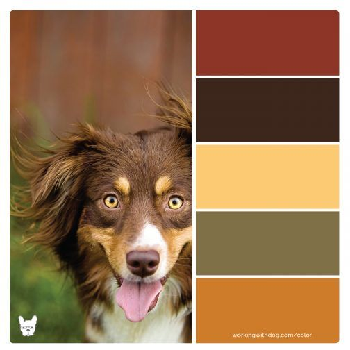

# What's up dawg?

This application was created following all the standards for a modern Android application.

## 🏗 Application architecture

The application was developed under the clean architecture and following the MVVM pattern. With the
views, written in Jetpack Compose, observing the status from the `ViewModel` through `StateFlows`.

All the data flows are flowing on a `IO` dispatcher, in order to remove the processing load from the
main thread making the ui more responsive. To do so, I decided to create a `DispatcherProvider` and
inject it on the `ViewModel` to facilitate the testing. On test environment, I replaced this
dispatcher by the `Main` one, to have more control over the data flow.

I decided to separate the models based on the layer, and create mappers to map these
models. `NetworkResponseMode -> DomainModel -> UiModel`. Doing that, we can isolate on layer from
changes in another. For instance, if the network response changes, I just need to update the network
model and the mapper. The rest of the application remains unchanged.

## 🎨 UI

### Jetpack Compose 🎶

The user interface was created
using [Jetpack Compose](https://developer.android.com/jetpack/compose/documentation). A brand new UI
framework made by Google and
Jetbrains. [Compose navigation](https://developer.android.com/jetpack/compose/navigation) as also
used to perform the navigation through the screens.

### Material you

The application theme and components was created following
the [Material You](https://m3.material.io/) guidelines. The color scheme was created using
the [Material theme builder](https://m3.material.io/theme-builder#/custom) and the main color was
generated using a dog image as base.

The application have light and dark theme.

## 💉 Dependency injection

I decided to use [Hilt](https://dagger.dev/hilt/) as dependency injection framework. It's developed
and recommended by google and has good interoperability with view models and jetpack compose.

## 🌎 Network

[Retrofit](https://square.github.io/retrofit/) was used to perform network calls. It's very easy to
setup and we can use `suspend` functions out of the box

## 🧪 Testing

### Unit testing

For unit testing I'm using JUnit and [Mockk](https://mockk.io/) to create mocks. I prefer it over
Mockito because it is more kotlin friendly and has good coroutines support.

I am also using a library called [Kotlin fixture](https://github.com/appmattus/kotlinfixture) to
generate dummy objects for test cases.

### UI testing

For ui testing I am using the Jetpack Compose test suite.

## 🛠 Tooling
I'm using some tools to catch memory leaks, maintain the code quality as well as lint the commit messages.
- [LeakCanary](https://square.github.io/leakcanary/): To catch memory leaks
- [Detekt](https://detekt.dev/): to perform static code analysis.
    - [Ktlint](https://pinterest.github.io/ktlint/): Together with detekt, I enabled ktlint to analyze code style
- [Commit Lint](https://plugins.gradle.org/plugin/ru.netris.commitlint): To lint the commit messages and make sure that all the commit follow the [Conventional commits standard](https://www.conventionalcommits.org/en/v1.0.0/)
- [Git hooks](https://plugins.gradle.org/plugin/com.star-zero.gradle.githook): To integrate the analysis tools on the development workflow.
    - Commit lint runs before every commit
    - Detekt/Ktlint runs before every push to make sure that we are not pushing non standard code

## What I would do next?
- e2e tests using a mock server
- introduce more animations, when navigation through screens for instance
- capability to open the images in a larger size
- network caching
